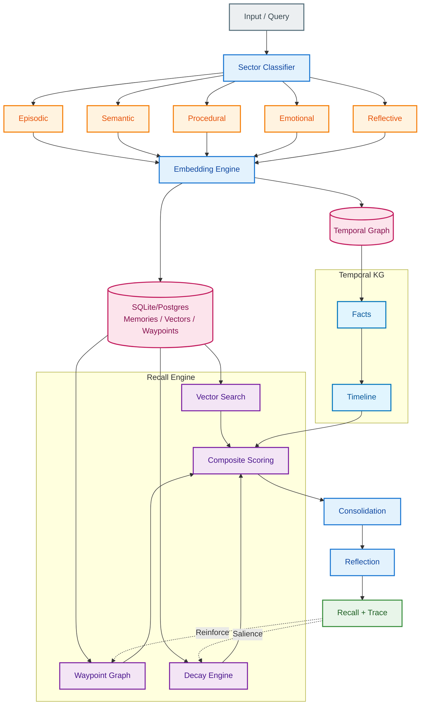

# OpenMemory

> **Real long-term memory for AI agents. Not RAG. Not a vector DB. Self-hosted, Python + Node.**

[](https://marketplace.visualstudio.com/items?itemName=Nullure.openmemory-vscode)
[](https://discord.gg/P7HaRayqTh)
[](https://pypi.org/project/openmemory-py/)
[](https://www.npmjs.com/package/openmemory-js)
[](LICENSE)


OpenMemory is a **cognitive memory engine** for LLMs and agents.

- 🧠 Real long-term memory (not just embeddings in a table)
- 💾 Self-hosted, local-first (SQLite / Postgres)
- 🐍 Python + 🟦 Node SDKs
- 🧩 Integrations: LangChain, CrewAI, AutoGen, Streamlit, MCP, VS Code
- 📥 Sources: GitHub, Notion, Google Drive, OneDrive, Web Crawler
- 🔍 Explainable traces (see *why* something was recalled)

Your model stays stateless. **Your app stops being amnesiac.**

---

## ☁️ One‑click Deploy

Spin up a shared OpenMemory backend (HTTP API + MCP + dashboard):

[](https://railway.app/template/YOUR_TEMPLATE_ID)
[](https://render.com/deploy?repo=https://github.com/CaviraOSS/OpenMemory)
[](https://vercel.com/new/clone?repository-url=https://github.com/CaviraOSS/OpenMemory)

> Use the SDKs when you want **embedded local memory**. Use the server when you want **multi‑user org‑wide memory**.

---

## 1. TL;DR – Use It in 10 Seconds

### 🐍 Python (local-first)

Install:

```bash
pip install openmemory-py
```

Use:

```python
from openmemory.client import Memory

mem = Memory()
mem.add("user prefers dark mode", user_id="u1")
results = mem.search("preferences", user_id="u1")
```

> Note: `add`, `search`, `get`, `delete` are async. Use `await` in async contexts.

#### 🔗 OpenAI

```python
mem = Memory()
client = mem.openai.register(OpenAI(), user_id="u1")
resp = client.chat.completions.create(...)
```

#### 🧱 LangChain

```python
from openmemory.integrations.langchain import OpenMemoryChatMessageHistory

history = OpenMemoryChatMessageHistory(memory=mem, user_id="u1")
```

#### 🤝 CrewAI / AutoGen / Streamlit

OpenMemory is designed to sit behind **agent frameworks and UIs**:

- Crew-style agents: use `Memory` as a shared long-term store
- AutoGen-style orchestrations: store dialog + tool calls as episodic memory
- Streamlit apps: give each user a persistent memory by `user_id`

See the integrations section in the docs for concrete patterns.

---

### 🟦 Node / JavaScript (local-first)

Install:

```bash
npm install openmemory-js
```

Use:

```ts
import { Memory } from "openmemory-js"

const mem = new Memory()
await mem.add("user likes spicy food", { user_id: "u1" })
const results = await mem.search("food?", { user_id: "u1" })
```

Drop this into:

- Node backends
- CLIs
- local tools
- anything that needs durable memory without running a separate service.

---

### 📥 Connectors

Ingest data from external sources directly into memory:

```python
# python
github = mem.source("github")
await github.connect(token="ghp_...")
await github.ingest_all(repo="owner/repo")
```

```ts
// javascript
const github = await mem.source("github")
await github.connect({ token: "ghp_..." })
await github.ingest_all({ repo: "owner/repo" })
```

Available connectors: `github`, `notion`, `google_drive`, `google_sheets`, `google_slides`, `onedrive`, `web_crawler`

---

## 2. Modes: SDKs, Server, MCP

OpenMemory can run **inside your app** or as a **central service**.

### 2.1 Python SDK

- ✅ Local SQLite by default
- ✅ Supports external DBs (via config)
- ✅ Great fit for LangChain / LangGraph / CrewAI / notebooks

Docs: https://openmemory.cavira.app/docs/sdks/python

---

### 2.2 Node SDK

- Same cognitive model as Python
- Ideal for JS/TS applications
- Can either run fully local or talk to a central backend

Docs: https://openmemory.cavira.app/docs/sdks/javascript

---

### 2.3 Backend server (multi-user + dashboard + MCP)

Use when you want:

- org‑wide memory
- HTTP API
- dashboard
- MCP server for Claude / Cursor / Windsurf

Run from source:

```bash
git clone https://github.com/CaviraOSS/OpenMemory.git
cd OpenMemory
cp .env.example .env

cd backend
npm install
npm run dev   # default :8080
```

Or with Docker:

```bash
docker compose up --build -d
```

The backend exposes:

- `/api/memory/*` – memory operations
- `/api/temporal/*` – temporal knowledge graph
- `/mcp` – MCP server
- dashboard UI

---

## 3. Why OpenMemory (vs RAG, vs “just vectors”)

LLMs forget everything between messages.  
Most “memory” solutions are really just **RAG pipelines**:

- text is chunked
- embedded into a vector store
- retrieved by similarity

They don’t understand:

- whether something is a **fact**, **event**, **preference**, or **feeling**
- how **recent / important** it is
- how it links to other memories
- what was true at a specific **time**

Cloud memory APIs add:

- vendor lock‑in
- latency
- opaque behavior
- privacy problems

**OpenMemory gives you an actual memory system:**

- 🧠 Multi‑sector memory (episodic, semantic, procedural, emotional, reflective)
- ⏱ Temporal reasoning (what was true *when*)
- 📉 Decay & reinforcement instead of dumb TTLs
- 🕸 Waypoint graph (associative, traversable links)
- 🔍 Explainable traces (see which nodes were recalled and why)
- 🏠 Self‑hosted, local‑first, you own the DB
- 🔌 SDKs + server + VS Code + MCP

It behaves like a memory module, not a “vector DB with marketing copy”.

---

## 4. The “Old Way” vs OpenMemory

**Vector DB + LangChain (cloud-heavy, ceremony):**

```python
import os
import time
from langchain.chains import ConversationChain
from langchain.memory import VectorStoreRetrieverMemory
from langchain_community.vectorstores import Pinecone
from langchain_openai import ChatOpenAI, OpenAIEmbeddings

os.environ["PINECONE_API_KEY"] = "sk-..."
os.environ["OPENAI_API_KEY"] = "sk-..."
time.sleep(3)  # cloud warmup

embeddings = OpenAIEmbeddings()
pinecone = Pinecone.from_existing_index(embeddings, index_name="my-memory")
retriever = pinecone.as_retriever(search_kwargs={"k": 2})
memory = VectorStoreRetrieverMemory(retriever=retriever)
conversation = ConversationChain(llm=ChatOpenAI(), memory=memory)

conversation.predict(input="I'm allergic to peanuts")
```

**OpenMemory (3 lines, local file, no vendor lock-in):**

```python
from openmemory.client import Memory

mem = Memory()
mem.add("user allergic to peanuts", user_id="user123")
results = mem.search("allergies", user_id="user123")
```

✅ Zero cloud config • ✅ Local SQLite • ✅ Offline‑friendly • ✅ Your DB, your schema

---

## 5. Features at a Glance

- **Multi-sector memory**  
  Episodic (events), semantic (facts), procedural (skills), emotional (feelings), reflective (insights).

- **Temporal knowledge graph**  
  `valid_from` / `valid_to`, point‑in‑time truth, evolution over time.

- **Composite scoring**  
  Salience + recency + coactivation, not just cosine distance.

- **Decay engine**  
  Adaptive forgetting per sector instead of hard TTLs.

- **Explainable recall**  
  “Waypoint” traces that show exactly which nodes were used in context.

- **Embeddings**  
  OpenAI, Gemini, Ollama, AWS, synthetic fallback.

- **Integrations**  
  LangChain, CrewAI, AutoGen, Streamlit, MCP, VS Code, IDEs.

- **Connectors**  
  Import from GitHub, Notion, Google Drive, Google Sheets/Slides, OneDrive, Web Crawler.

- **Migration tool**  
  Import memories from Mem0, Zep, Supermemory and more.

If you’re building **agents, copilots, journaling systems, knowledge workers, or coding assistants**, OpenMemory is the piece that turns them from “goldfish” into something that actually remembers.

---

## 6. MCP & IDE Workflow

OpenMemory ships a native MCP server, so any MCP‑aware client can treat it as a tool.

### Claude / Claude Code

```bash
claude mcp add --transport http openmemory http://localhost:8080/mcp
```

### Cursor / Windsurf

`.mcp.json`:

```json
{
  "mcpServers": {
    "openmemory": {
      "type": "http",
      "url": "http://localhost:8080/mcp"
    }
  }
}
```

Available tools include:

- `openmemory_query`
- `openmemory_store`
- `openmemory_list`
- `openmemory_get`
- `openmemory_reinforce`

Your IDE assistant can query, store, list, and reinforce memories without you wiring every call manually.

---

## 7. Temporal Knowledge Graph

OpenMemory treats **time** as a first‑class dimension.

### Concepts

- `valid_from` / `valid_to` – truth windows
- auto‑evolution – new facts close previous ones
- confidence decay – old facts fade gracefully
- point‑in‑time queries – “what was true on X?”
- timelines – reconstruct an entity’s history
- change detection – see when something flipped

### Example

```http
POST /api/temporal/fact
{
  "subject": "CompanyX",
  "predicate": "has_CEO",
  "object": "Alice",
  "valid_from": "2021-01-01"
}
```

Then later:

```http
POST /api/temporal/fact
{
  "subject": "CompanyX",
  "predicate": "has_CEO",
  "object": "Bob",
  "valid_from": "2024-04-10"
}
```

Alice’s term is automatically closed; timeline queries stay sane.

---

## 8. CLI (opm)

The `opm` CLI talks directly to the engine / server.

### Install

```bash
cd backend
npm install
npm link   # adds `opm` to your PATH
```

### Commands

```bash
opm add "user prefers dark mode" --user u1 --tags prefs
opm query "preferences" --user u1 --limit 5
opm list --user u1
opm reinforce <id>
opm stats
```

Useful for scripting, debugging, and non‑LLM pipelines that still want memory.

---

## 9. Architecture (High Level)

OpenMemory uses **Hierarchical Memory Decomposition** with a temporal graph on top.



---

## 10. Migration

OpenMemory ships a migration tool to import data from other memory systems.

Supported:

- Mem0
- Zep
- Supermemory

Example:

```bash
cd migrate
python -m migrate --from zep --api-key ZEP_KEY --verify
```

(See `migrate/` and docs for detailed commands per provider.)

---

## 11. Roadmap

- 🧬 Learned sector classifier (trainable on your data)
- 🕸 Federated / clustered memory nodes
- 🤝 Deeper LangGraph / CrewAI / AutoGen integrations
- 🔭 Memory visualizer 2.0
- 🔐 Pluggable encryption at rest

Star the repo to follow along.

---

## 12. Contributing

Issues and PRs are welcome.

- Bugs: https://github.com/CaviraOSS/OpenMemory/issues
- Feature requests: use the GitHub issue templates
- Before large changes, open a discussion or small design PR

---

## 13. License

OpenMemory is licensed under **Apache 2.0**. See [LICENSE](LICENSE) for details.